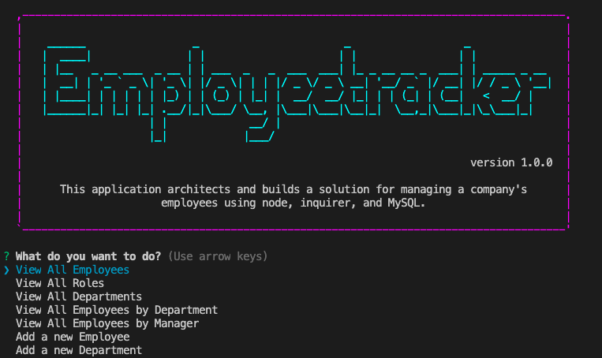
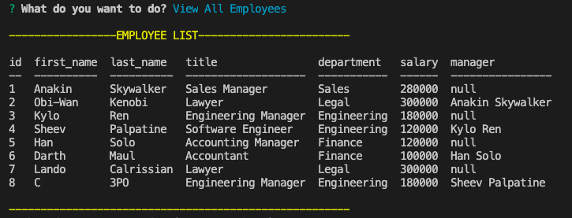

# EMPLOYEE TRACKER

## Table of Contents

- [Description](#description)
- [How to Install Dependencies](#how-to-install-dependencies)
- [Usage](#usage)
- [License](#license)
- [Contributoring](#contributing)
- [Tests](#tests)
- [Questions](#questions)

## Description

This application builds a solution for managing a company's employees using node, inquirer, and MySQL.

## How to install dependencies

Please use: npm i

## Usage

Screenshot 1: Once the node is read, the application will output the app title and get-started menu.

---

Screenshot 2: The application will output the result in a table accordingly to the user choice.

---

Please find the 40-sec demo video from here:
https://drive.google.com/file/d/1keavomZ2aokFNoJ3VS0wuKSJMHs2oXy7/view?usp=sharing

## License

MIT

## Contributing

Pull requests are welcome. For major changes, please open an issue first to discuss what you would like to change. Also, please make sure to update tests as appropriate.

## Questions

[Email Me!](mailto:nishii.dev.syd@gmail.com)

[Link to my GitHub](https://github.com/noriyuki-ishii-820)
